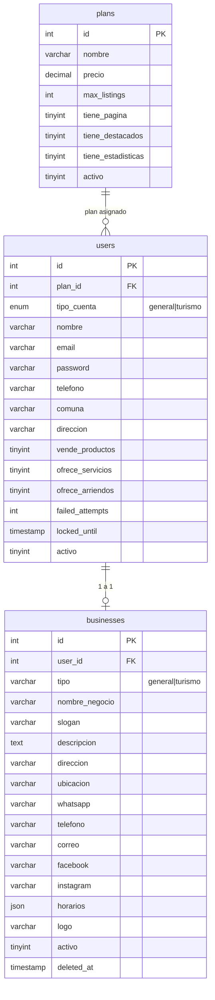
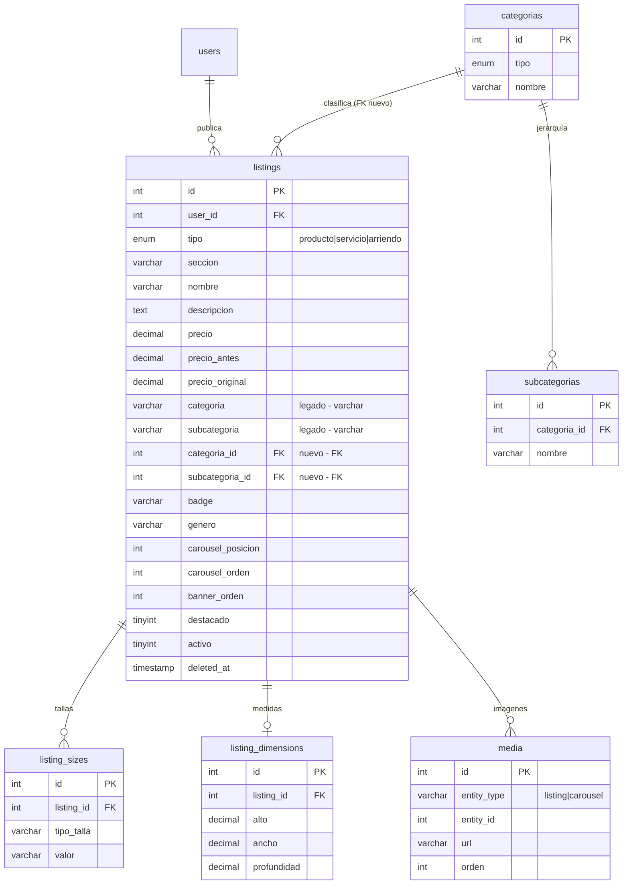
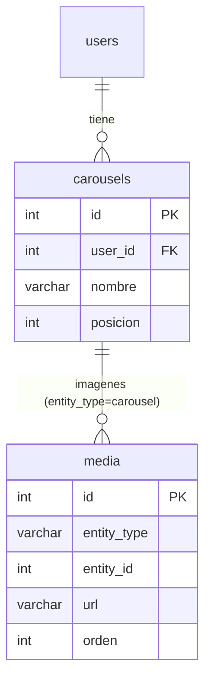
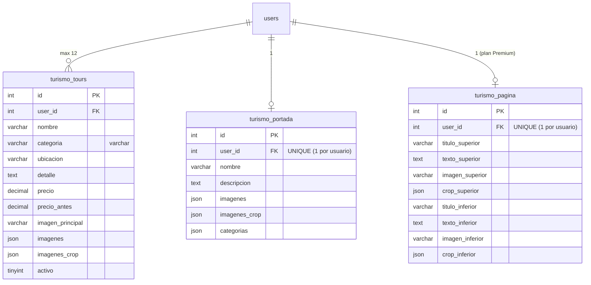
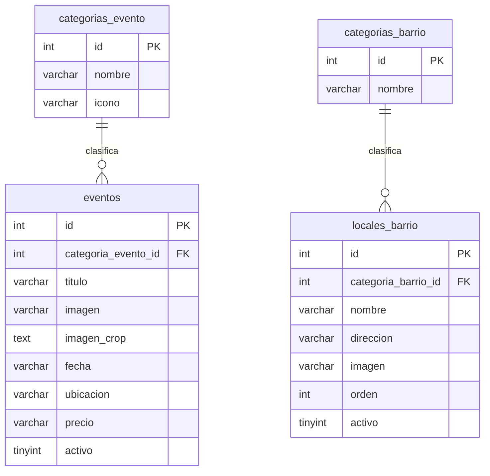
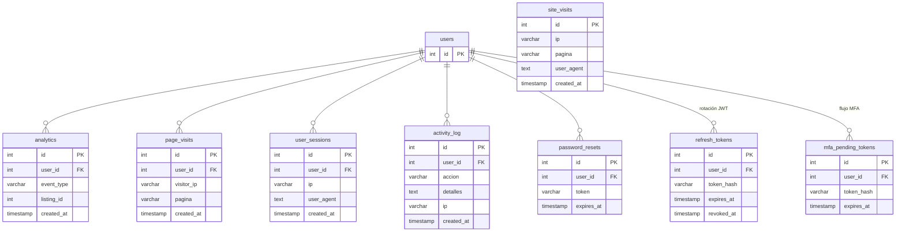

# Diagrama de Base de Datos — Solo a un Click (v2 · Homologado)

**Fecha:** 19 de Abril 2026
**Motor:** MySQL 8.0
**Total de tablas:** 25
**Branch:** `feature/db-schema-v2`
**Estado:** Este documento refleja la **realidad operativa** de producción (`158.220.123.58`) verificada por inspección directa de `information_schema`.

> 🔄 Sustituye a `diagrama_BD.md` (15-abr). Cambios clave: +2 tablas de auth, +9 campos reales en listings, FK de categorías, FK dual en turismo_*, patrones mixtos de imágenes.

---

## Mapa general por módulo

| Módulo | Tablas | Scope FK | Imágenes |
|---|---|---|---|
| 1. Config | plans, categorias, subcategorias, categorias_evento, categorias_barrio | — | — |
| 2. Usuarios & Negocios | users, businesses | user_id | — |
| 3. Publicaciones | listings, listing_sizes, listing_dimensions | **user_id** | tabla `media` |
| 4. Carruseles | carousels | **user_id** | tabla `media` |
| 5. Turismo | turismo_tours, turismo_portada, turismo_pagina | **user_id** (+FK dual obsoleta) | **JSON inline** |
| 6. Editorial | eventos, locales_barrio | — | varchar URL |
| 7. Analytics & Auth | analytics, page_visits, site_visits, user_sessions, activity_log, password_resets, **refresh_tokens**, **mfa_pending_tokens** | user_id | — |
| 8. Deuda técnica | **listing_images** (tabla muerta, 0 filas) | — | candidate DROP |

---

## Módulo 1 — Usuarios y Negocios

**Notas:**
- `businesses.tipo` discrimina `general` vs `turismo` (no documentado previamente).
- `users` tiene control de bloqueo por intentos fallidos (`failed_attempts`, `locked_until`).

---

## Módulo 2 — Publicaciones (Listings)

**Estado dual de categorías:**
- `categoria` (varchar) y `categoria_id` (FK) coexisten.
- Backend escribe ambas. Frontend aún usa solo `categoria` (varchar).
- **Dirección deseada:** completar FK, dejar `categoria_id` como única fuente. Ver ROADMAP.

---

## Módulo 3 — Carruseles

- Max 8 imágenes por carousel.
- Hard delete de `media` + archivo en disco cuando se elimina imagen.

---

## Módulo 4 — Turismo

> ⚠️ Patrón de imágenes **distinto** al resto del sistema: usa JSON inline (no tabla `media`).

**⚠️ Deuda — FK dual:** Las 3 tablas tienen 2 foreign keys simultáneas en `user_id`: una a `users.id` y otra huérfana a `businesses.user_id`. El código solo usa la primera. La segunda es basura heredada — limpiar en próxima migración.

---

## Módulo 5 — Eventos y Locales (editorial)

---

## Módulo 6 — Analytics, Sesiones y Auth

**Nuevas tablas (no documentadas antes):**
- `refresh_tokens` — rotación JWT con revocación.
- `mfa_pending_tokens` — tokens temporales durante flujo MFA.

---

## Patrones de imágenes (homologado)

| Entidad | Dónde se guardan | Razón |
|---|---|---|
| `listings` | Tabla `media` (polimórfica, N imágenes) | N variable, requiere orden |
| `carousels` | Tabla `media` (polimórfica, max 8) | Requiere orden y borrado masivo |
| `turismo_tours` | JSON en `imagenes` + `imagenes_crop` | Array fijo pequeño (≤3), incluye metadata de recorte |
| `turismo_portada` | JSON en `imagenes` + `imagenes_crop` | Array fijo (=3), layout "fan" |
| `turismo_pagina` | Columnas varchar `imagen_superior/inferior` + JSON `crop_*` | 2 imágenes fijas con metadata |
| `eventos` / `locales_barrio` | Columna varchar `imagen` | 1 imagen, editorial |

**Conclusión:** El patrón mixto es **intencional y óptimo** para los casos de uso. No se consolida todo en `media`.

---

## Deuda técnica documentada

| # | Deuda | Acción recomendada |
|---|---|---|
| D-1 | Tabla `listing_images` (0 filas, sin uso en código) | `DROP TABLE listing_images` |
| D-2 | FK dual en `turismo_tours/portada/pagina.user_id` hacia `businesses.user_id` | Drop de la FK redundante |
| D-3 | Columnas `listings.categoria`/`subcategoria` (varchar) | Migrar frontend a FK, luego drop |
| D-4 | Migración `user_id` → `business_id` | Pospuesta (ver ROADMAP) |

---

*Homologado contra: BD real de producción, backend `backend/routes/*.js`, frontend `src/**/*.jsx`.*
