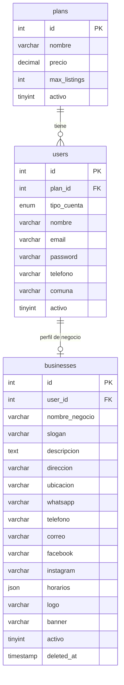
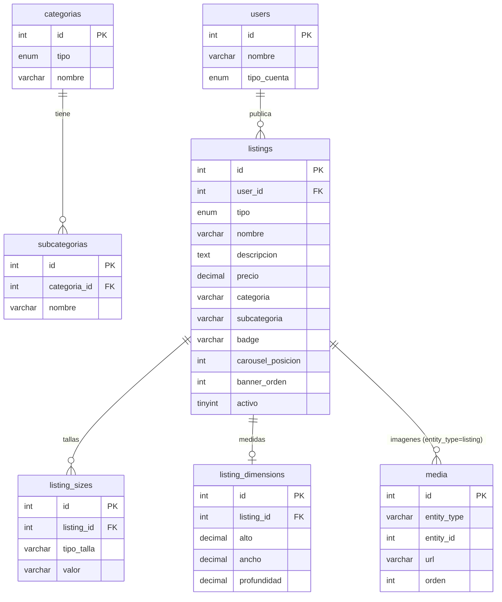
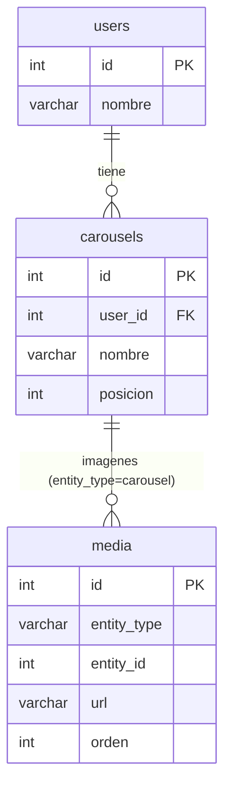
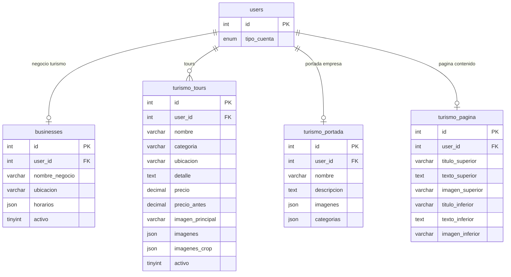
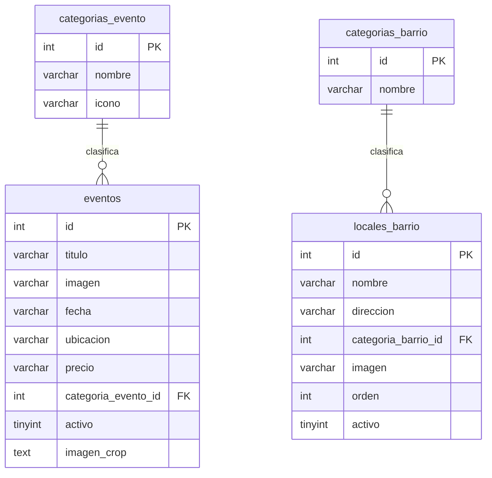
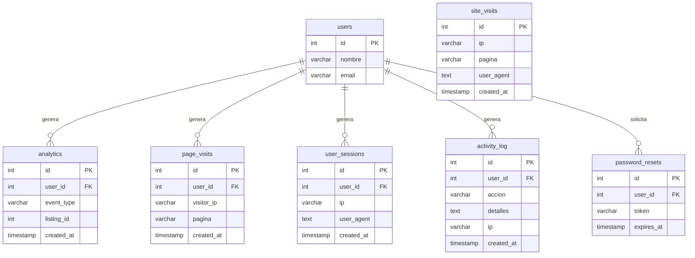

# Diagrama de Base de Datos — Solo a un Click

**Total de tablas:** 24
**Motor:** MySQL 8.0
**Última actualización:** 15 de Abril 2026

---

## Módulo 1 — Usuarios y Negocios (núcleo)

> El centro del sistema. Todo usuario tiene un plan y puede tener un negocio asociado.

---

## Módulo 2 — Publicaciones (Listings)

> Productos, servicios y arriendos publicados por los usuarios. Las imágenes van a la tabla `media`.

---

## Módulo 3 — Carruseles

> Banners de imágenes configurables por usuario. Las imágenes también van a `media`.

---

## Módulo 4 — Turismo

> Módulo independiente para cuentas de tipo turismo. Tres tablas: tours, portada de la empresa y página de contenido.

---

## Módulo 5 — Eventos y Locales

> Contenido editorial gestionado por los programadores del sitio (no por usuarios).

---

## Módulo 6 — Analytics y Sistema

> Registro de actividad, visitas, sesiones y seguridad. Todo apunta a `users` pero con FK opcional.

---

## Resumen de Relaciones

| Tabla | Se conecta con | Tipo |
|-------|---------------|------|
| `plans` | `users` | 1 plan → muchos usuarios |
| `users` | `businesses` | 1 usuario → 1 negocio |
| `users` | `listings` | 1 usuario → muchos listings |
| `users` | `carousels` | 1 usuario → muchos carruseles |
| `users` | `turismo_tours` | 1 usuario → muchos tours |
| `users` | `turismo_portada` | 1 usuario → 1 portada |
| `users` | `turismo_pagina` | 1 usuario → 1 página |
| `categorias` | `subcategorias` | 1 categoría → muchas subcategorías |
| `listings` | `listing_sizes` | 1 listing → muchas tallas |
| `listings` | `listing_dimensions` | 1 listing → 1 medida |
| `listings` | `media` | 1 listing → muchas imágenes (polimórfica) |
| `carousels` | `media` | 1 carrusel → muchas imágenes (polimórfica) |
| `categorias_evento` | `eventos` | 1 categoría → muchos eventos |
| `categorias_barrio` | `locales_barrio` | 1 categoría → muchos locales |
| `users` | `analytics`, `page_visits`, `user_sessions`, `activity_log`, `password_resets` | 1 usuario → muchos registros |

### Nota sobre `media` (tabla polimórfica)
La tabla `media` no tiene FK directa. En cambio usa dos campos:
- `entity_type` — indica a qué tabla pertenece (`'listing'` o `'carousel'`)
- `entity_id` — indica el ID del registro en esa tabla

Esto permite que una sola tabla de imágenes sirva para múltiples entidades.
